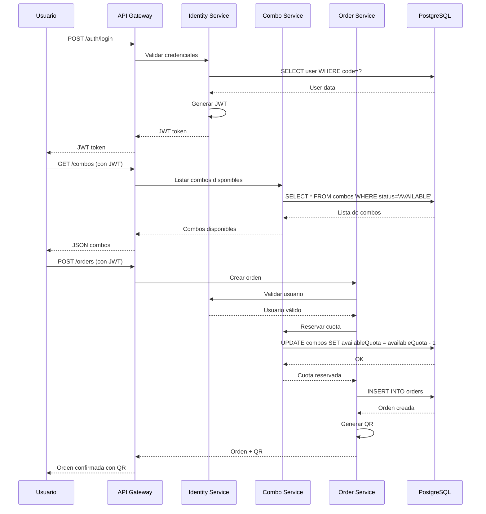

# LunchUIS Platform 🍽️

[](https://spring.io/projects/spring-boot)
[](https://www.oracle.com/java/)
[](https://www.postgresql.org/)
[](https://www.docker.com/)
[](https://opensource.org/licenses/MIT)

## 📋 Descripción del Proyecto

**LunchUIS** es una plataforma web para la gestión automatizada de compra de "combos saludables" en la Universidad Industrial de Santander. El sistema elimina las largas filas presenciales, previene compras fraudulentas mediante autenticación robusta, y digitaliza el proceso de reclamación con tokens QR.

### 🎯 Problemática

- **Largas filas:** Los estudiantes pierden tiempo valioso esperando para comprar
- **Inseguridad:** Posibilidad de compras múltiples con carnets ajenos
- **Ineficiencia:** Tickets físicos generan desperdicio y pueden perderse
- **Accesibilidad limitada:** Estudiantes que viven lejos pierden oportunidades

### ✨ Solución

Sistema de gestión digital que permite:
- Compra online desde cualquier lugar
- Autenticación de dos factores (JWT + correo institucional)
- Generación de QR para reclamación sin contacto
- Una compra por usuario por día
- Disponibilidad 7am-8pm, lunes a viernes

---

## 🏗️ Arquitectura del Sistema

### Arquitectura de Microservicios

<div align="center">
  
  <p><em>Figura 1: Arquitectura de microservicios del sistema LunchUIS</em></p>
</div>

El sistema implementa una **arquitectura orientada a microservicios** con los siguientes componentes:

#### 🔧 Componentes Principales

| Microservicio | Puerto | Responsabilidad | Base de Datos |
|--------------|--------|-----------------|---------------|
| **Config Server** | 8888 | Configuración centralizada | - |
| **Identity Service** | 8081 | Autenticación y autorización | Schema `identity` |
| **Combo Service** | 8082 | Gestión de combos (CRUD) | Schema `combos` |
| **Order Service** | 8083 | Procesamiento de pedidos | Schema `orders` |
| **API Gateway (Kong)** | 8000/8080 | Enrutamiento y seguridad | - |

#### 📊 Capa de Persistencia

- **PostgreSQL**: Base de datos compartida con esquemas aislados por servicio
- **Schemas separados**: `identity`, `combos`, `orders`
- **JPA/Hibernate**: Mapeo objeto-relacional

---

## 🔐 Seguridad y Autenticación

### Flujo de Autenticación JWT
```
1. Usuario → POST /auth/login (código + contraseña)
2. Identity Service → Valida credenciales
3. Identity Service → Genera JWT firmado (HS256)
4. Cliente → Recibe token (válido 24h)
5. Cliente → Incluye token en header: Authorization: Bearer <token>
6. Servicios → Validan JWT con clave compartida
```

### Características de Seguridad

- ✅ **Stateless Authentication**: JWT sin sesiones del lado del servidor
- ✅ **Role-Based Access Control (RBAC)**: Roles `STUDENT` y `ADMIN`
- ✅ **Password Hashing**: BCrypt con salt automático
- ✅ **2FA (Planeado)**: Código de verificación por correo institucional
- ✅ **Protection Endpoints**: `@PreAuthorize("hasRole('ADMIN')")`

---

## 🚀 Requerimientos Funcionales (Sprint 1)

### RF1: Ingresar al Sistema
- **Actores**: Estudiante, Administrador
- **Entrada**: Código institucional + contraseña
- **Validación**: Máximo 3 intentos fallidos → bloqueo 24h
- **Salida**: JWT token de autenticación

### RF2: Crear Combo (Admin)
- **Actores**: Administrador de combos
- **Entrada**: Nombre, descripción, precio, imagen, tipo (DAILY/MONTHLY), cuota, fecha validez
- **Validación**: Todos los campos obligatorios
- **Salida**: Combo disponible para compra

### RF3: Modificar Combo (Admin)
- **Actores**: Administrador de combos
- **Validación**: Cuota total ≥ combos vendidos
- **Salida**: Combo actualizado

### RF4: Eliminar Combo (Admin)
- **Restricción**: Solo si no hay órdenes asociadas
- **Validación**: Confirmación requerida

---

## ⚙️ Requerimientos No Funcionales

### RNF1: Arquitectura de Microservicios
- **Objetivo**: Modularidad, escalabilidad y facilidad de mantenimiento
- **Implementación**: Servicios independientes con comunicación HTTP/REST
- **Ventajas**: Despliegue independiente, resiliencia ante fallos

### RNF2: Disponibilidad
- **Horario**: 7:00 AM - 8:00 PM (13 horas), Lunes a Viernes
- **SLA**: 99.96% uptime (máximo 30 min downtime/semana)
- **Monitoreo**: Spring Boot Actuator + health checks

### RNF3: Concurrencia
- **Capacidad**: Mínimo 500 transacciones simultáneas
- **Tecnología**: Pooling de conexiones, transacciones ACID
- **Pruebas**: Simulaciones de carga con JMeter

### RNF4: Seguridad
- **Encriptación**: Contraseñas con BCrypt (factor 10)
- **Tokens**: JWT firmados con HS256
- **Protocolos**: HTTPS en producción
- **Validación**: Jakarta Bean Validation en DTOs

---

## 🛠️ Stack Tecnológico

### Backend
```yaml
Lenguaje: Java 21
Framework: Spring Boot 3.5.6
Seguridad: Spring Security 6
Persistencia: Spring Data JPA
Validación: Jakarta Validation
Mapeo: MapStruct 1.6.3
Documentación: SpringDoc OpenAPI 3
```

### Infraestructura
```yaml
Base de Datos: PostgreSQL 17
Contenedores: Docker + Docker Compose
Gateway: Kong API Gateway
Config: Spring Cloud Config Server
Build: Maven 3.9
```

### Librerías Clave
- **JWT**: `jjwt` 0.13.0 (io.jsonwebtoken)
- **Lombok**: Reducción de boilerplate
- **Logback**: Logging estructurado

---

## 📦 Estructura del Proyecto
```
lunchuis-platform/
├── common-library/          # DTOs, excepciones, mappers compartidos
│   ├── dto/
│   ├── enums/              # ComboStatus, ComboType, RoleType
│   ├── exception/          # DomainException, GlobalExceptionHandler
│   └── mapper/
├── config-server/          # Configuración centralizada (8888)
│   └── src/main/resources/config/
├── identity-server/        # Autenticación y usuarios (8081)
│   ├── application/        # DTOs, servicios, mappers
│   ├── domain/            # User, Role (modelos)
│   ├── infrastructure/    # JPA, seguridad, persistencia
│   └── web/               # Controllers REST
├── combo-server/          # Gestión de combos (8082)
│   ├── application/
│   ├── domain/            # Combo (modelo)
│   ├── infrastructure/
│   └── web/
├── order-server/          # Pedidos (8083) [En desarrollo]
└── docker-compose.yml     # Orquestación de servicios
```

---

## 🚦 Guía de Inicio Rápido

### Prerrequisitos
- Java 21+
- Docker & Docker Compose
- Maven 3.9+
- PostgreSQL 17 (opcional, incluido en Docker)

### Instalación

1. **Clonar el repositorio**
```bash
git clone https://github.com/SebAs-man/LunchUIS.git
cd LunchUIS
```

2. **Configurar variables de entorno**
```bash
# Crear archivo .env en la raíz
DB_USERNAME=lunchuis_user
DB_PASSWORD=secure_password_123
DB_NAME=lunchuis_db
DB_PORT=5432
JWT_SECRET=your-256-bit-secret-key-base64-encoded
JWT_EXPIRATION=86400000  # 24 horas en ms
```

3. **Iniciar servicios con Docker**
```bash
docker-compose up -d
```

4. **Verificar estado de los servicios**
```bash
# Config Server
curl http://localhost:8888/actuator/health

# Identity Service
curl http://localhost:8081/actuator/health

# Combo Service
curl http://localhost:8082/actuator/health
```

### Acceso a la Documentación API

- **Identity Service**: http://localhost:8081/swagger-ui.html
- **Combo Service**: http://localhost:8082/swagger-ui.html
- **Config Server**: http://localhost:8888/actuator

---

## 📝 Casos de Uso Principales

### 1. Registro de Usuario
```bash
POST http://localhost:8081/api/v1/auth/register
Content-Type: application/json

{
  "firstName": "Carlos",
  "lastName": "Beltrán",
  "institutionalCode": 2180001,
  "email": "carlos.beltran@uis.edu.co",
  "password": "SecureP@ss123"
}
```

### 2. Login y Obtención de JWT
```bash
POST http://localhost:8081/api/v1/auth/login
Content-Type: application/json

{
  "institutionalCode": 2180001,
  "password": "SecureP@ss123"
}

# Respuesta
{
  "token": "eyJhbGciOiJIUzI1NiIsInR5cCI6IkpXVCJ9..."
}
```

### 3. Crear Combo (Admin)
```bash
POST http://localhost:8082/api/v1/combos
Authorization: Bearer <JWT_TOKEN>
Content-Type: application/json

{
  "name": "COMBO DIARIO NOVIEMBRE 01",
  "description": "Pollo, arroz, ensalada, jugo",
  "price": 8000.00,
  "status": "AVAILABLE",
  "type": "DAILY",
  "totalQuota": 150,
  "validFrom": "2025-11-01",
  "validTo": null
}
```

### 4. Listar Combos Disponibles
```bash
GET http://localhost:8082/api/v1/combos
Authorization: Bearer <JWT_TOKEN>
```

---

## 🔄 Flujo de Datos: Compra de Combo


---

## 👥 Equipo de Desarrollo

| Rol | Nombre | Responsabilidad |
|-----|--------|-----------------|
| **Product Owner** | Mag. Carlos Adolfo Beltrán Castro | Definición de requisitos y prioridades |
| **Scrum Master** | Kevin Daniel Castro Mendoza | Facilitación y remoción de impedimentos |
| **Developer Architecture** | Andrea Juliana Portilla Barrera | Diseño de arquitectura y patrones |
| **Developer Coding** | Kevin Castro, Sebastián Mantilla, Andrea Portilla | Implementación backend |
| **QA Member** | Juan Sebastián Mantilla Serrano | Pruebas y validación de calidad |

---

## 📊 Métricas del Sistema

### Sprint 1 (Actual)
- ✅ Sistema de autenticación completo
- ✅ Gestión CRUD de combos
- ✅ Validación de roles y permisos
- ✅ Documentación API con Swagger
- ⏳ Integración de órdenes (en progreso)

### Cobertura Técnica
- **Microservicios**: 3/4 completados (75%)
- **Endpoints implementados**: 15+
- **Esquemas de BD**: 3/3 (identity, combos, orders)
- **Tests**: Pendientes (próximo sprint)

---

## 🎓 Contexto Académico

**Asignatura**: Entornos de Programación  
**Semestre**: II - 2025  
**Institución**: Universidad Industrial de Santander  
**Escuela**: Ingeniería de Sistemas e Informática

---

## 📄 Licencia

Este proyecto está licenciado bajo la [MIT License](LICENSE).

---

## 🔗 Enlaces Útiles

- [Documentación Spring Boot](https://spring.io/projects/spring-boot)
- [Spring Security Reference](https://docs.spring.io/spring-security/reference/index.html)
- [JWT.io](https://jwt.io/) - Debugger de tokens
- [Docker Documentation](https://docs.docker.com/)

---

<div align="center">
  <p><strong>Desarrollado con ❤️ por el Equipo LunchUIS</strong></p>
  <p>Universidad Industrial de Santander - 2025</p>
</div>
